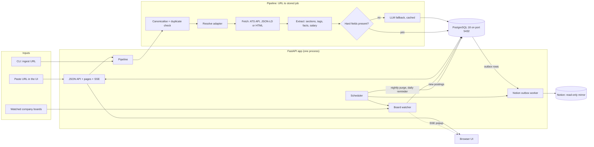
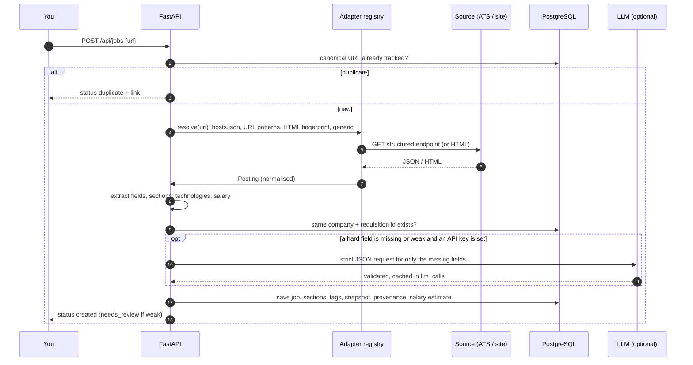
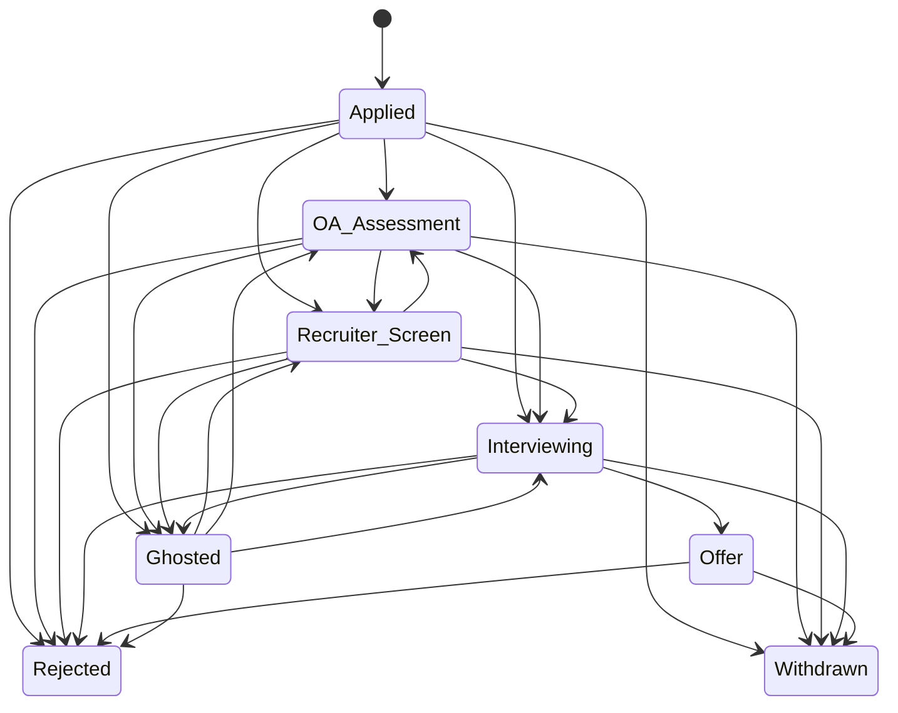
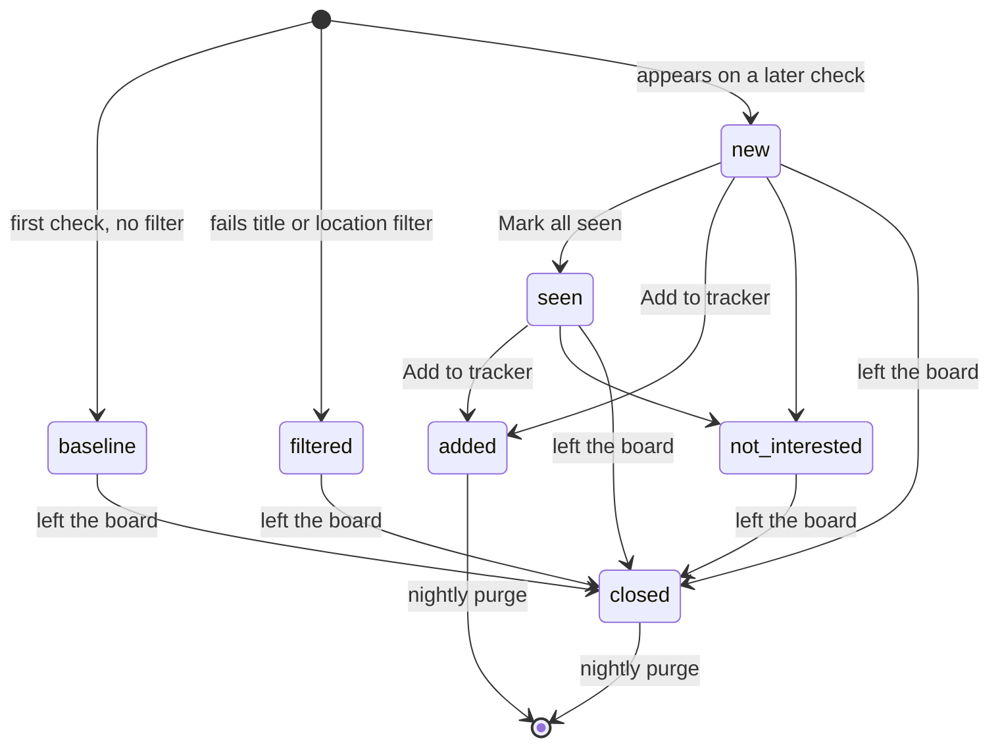
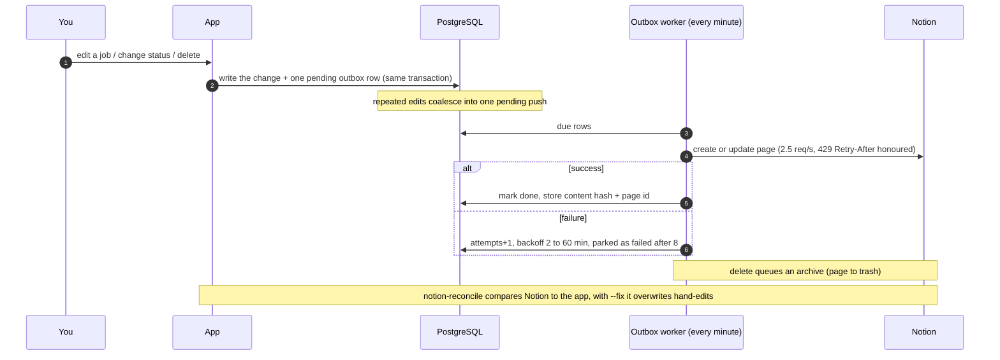
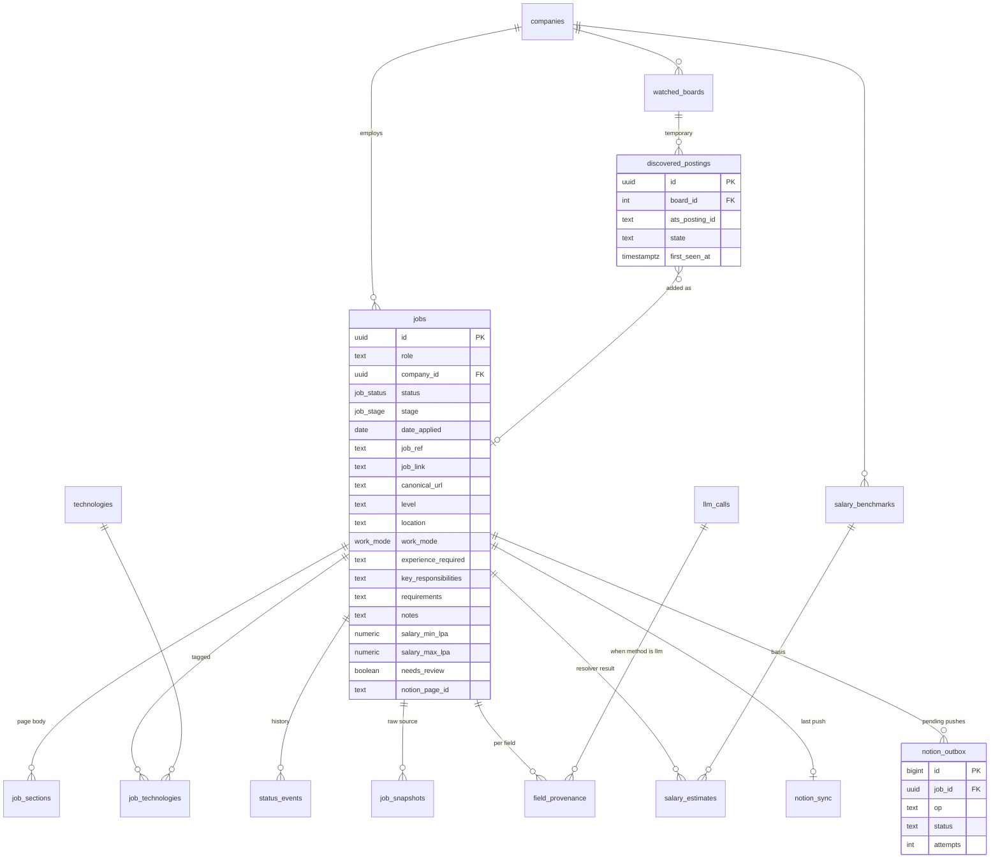

# Architecture

A self-hosted replacement for the Notion "Job Tracker" database. Paste a job URL, or let the board watcher find new postings; a deterministic pipeline fills in the record, and an LLM is used only as a narrow fallback. Notion stays as a read-only mirror. Why each choice was made is in [decisions.md](decisions.md).

## 1. What replaced what

Each application used to make Claude read the posting, fill about 19 properties, tag technologies, research salary and write notes. Now:

| Notion property | Filled by | How |
|---|---|---|
| Role, Company, Job ID, Location | code | ATS API fields, JSON-LD, or the URL |
| Job Link | code | the pasted URL |
| Date Applied, Status | you (one click or drag) | status state machine with history |
| Work Mode | code | explicit ATS value, else text rules (`hybrid`, `required in office`, `N days a week`) |
| Level | code | title rules in `vocab.json` plus any explicit token (`IC3`, `L5`, `SDE-3`) |
| Experience Required | code | regex over the requirements, with min/max years |
| Team / Domain | code | ATS department; else a `Team:` label, a "join the X team" sentence or a title suffix (`extract/team.py`), with a domain hint appended ("Name — Payments"). Blank when unsure; Claude's longer prose is not reproduced |
| Key Responsibilities, Requirements | code | heading-based section split; nice-to-have separated from required |
| Key Technologies | code | dictionary of your 100 tags; required vs nice-to-have follows the section |
| Salary Min/Max, Details, Sources | code | pay range printed in the posting (INR), else your imported benchmarks |
| Notes | you | free text (fit scoring is v2, see [roadmap.md](roadmap.md)) |
| Page body | code | stored sections, mirrored to Notion at creation |

The LLM fallback (title, company, location, responsibilities, requirements, plus soft fields) runs only when a hard field is missing. It needs `ANTHROPIC_API_KEY`; without one the job is simply flagged for review.

## 2. System diagram

## 3. Ingesting one job

If a structured adapter fails (schema drift, an HTTP error other than "gone"), the pipeline falls back to the generic parser and records how.

## 4. Status state machine

Statuses are exactly the Notion options. Moves are checked against `status_transitions`; each change writes a `status_events` row. "Ghosted" is set by hand.

`OA_Assessment` is "OA / Assessment" and `Recruiter_Screen` is "Recruiter Screen" in the database (diagram ids cannot contain spaces or slashes). A job in the Inbox stage has no status; the first move must be to Applied.

## 5. Board watcher and the discovery lifecycle

- A posting becomes `closed` only if the listing was **complete**. Adapters that stop at a page cap say so, and an incomplete or empty listing closes nothing.
- A posting that is already a tracked job is never re-surfaced; that is why `added` rows can be purged.
- `not_interested` is kept until the posting closes, otherwise the next poll would show it as new again.
- Undecided (`new` or `seen`) postings older than 2 days raise the banner on every page, plus a daily 09:00 popup.

## 6. Notion mirror (read-only, outbox)

## 7. Data model (17 tables)

Tables not shown: `status_transitions` (allowed moves), `intake_queue` (unused, see decision 18). Three views: `v_pipeline`, `v_funnel` (used by `/api/funnel`), `v_tech_demand`.

## 8. Code map

| Path | Role |
|---|---|
| `src/jobtracker/__main__.py` | command-line entry point |
| `src/jobtracker/config.py`, `.env` | settings |
| `src/jobtracker/models.py` | shared shapes: Posting, Section, PayRange, ListedPosting, ListedBatch |
| `src/jobtracker/urls.py` | canonical URLs, company-name normalisation |
| `src/jobtracker/http.py` | polite client: per-host spacing, retries, "posting gone" |
| `src/jobtracker/adapters/` | one file per source plus `registry.py` and `base.py` |
| `src/jobtracker/extract/` | `text`, `sections`, `facts`, `tech`, `salary`, `vocab`, and `job.py` that wires them |
| `src/jobtracker/pipeline.py` | URL or pasted text to stored job (`ingest`, `ingest_text`, shared `store_posting`) |
| `src/jobtracker/extract/pasted.py` | pasted text to a Posting: company/title/location detection, plain-text headings, duplicate key |
| `extension/` | Chrome extension (Manifest V3): `reader.js` reads the page, `background.js` posts it to `/api/capture` and opens the review window |
| `src/jobtracker/web/static/modal.js`, `chips.js` | the shared dialog shell (blur, focus, Esc) and the chips input; the job viewer and the board editor both use them |
| `src/jobtracker/web/static/jobview.js` | job details: the modal over any page and the full page at `/jobs/{id}`, one renderer |
| `src/jobtracker/web/static/preview.js` | the review form, shared by Home and the extension's pop-up |
| `src/jobtracker/migrate.py` | tracked, forward-only migrations: baseline on an empty database, then pending `db/migrations/*.sql` |
| `src/jobtracker/filters.py` | one reading of a board filter term (plain words, `/regex/`, city spellings); used by the watcher, the preview and Workday |
| `src/jobtracker/boards.py`, `suggestions.py`, `board_options.py` | editing and previewing boards; filter suggestions from applied jobs; the options in `config/boards.json` |
| `src/jobtracker/adapters/discovery.py` | reads an unfamiliar careers page and says which supported job system is behind it (redirects, the page being the system's front end, scripts/frames, links, one job page); no probing |
| `src/jobtracker/portals.py` | ties discovery to the database: loads and remembers learned career domains (`portal_hosts`), checks a found system really lists jobs |
| `src/jobtracker/web/diagnostics.py` | lag recorder: writes `logs/diagnostics.log` only when the event loop is stuck (with the stuck code's stack), a request or background job is slow, or the database pool is busy; limits are `SLOW_REQUEST_SECONDS` and `LOOP_STALL_SECONDS` in `.env` |
| `src/jobtracker/reparse.py` | rebuild a posting from a job's saved snapshot and re-extract it (`reparse` command) |
| `src/jobtracker/extract/team.py` | team / domain from labels, sentences and title suffixes |
| `src/jobtracker/llm.py` | optional fallback with validation and caching |
| `src/jobtracker/repo.py` | every SQL statement |
| `src/jobtracker/watcher.py`, `events.py` | board polling and the SSE bus |
| `src/jobtracker/notion_sync.py` | payloads, throttled calls, outbox worker, import, reconcile |
| `src/jobtracker/web/` | FastAPI app and templates |
| `config/vocab.json`, `config/hosts.json` | tags and levels; custom career domains |
| `db/schema.sql` | PostgreSQL schema |
| `scripts/` | `db.ps1` (`bootstrap` creates roles and database, `apply` loads the schema), `capture_fixtures.py`, `golden.py`, `build_diagrams.py` |
| `tests/` | 93 tests; fixtures are real captured responses |

## 9. Known limitations

- Descriptions can carry text outside any element (Workday does). The text reader takes it line by line at each ` `, guesses headings from plain lines, and `text_coverage` (used by `scripts/golden.py` and the tests) measures what share of the visible words survive extraction. Finding a "responsibilities" section is not proof the section is complete.
- The LLM fallback and the Notion mirror have never run against the live services; both are tested with fakes only.
- The generic HTML path is the weakest (custom career sites, LinkedIn, Indeed): on the 100-row export it extracted responsibilities well in only about a quarter of cases and most such jobs need review or the LLM.
- Technology tags average about 60% recall against what Claude chose, because Claude also inferred skills (for example "Microservices") that no posting states.
- Salary is blank for most Indian postings until benchmarks are imported.
- Undocumented endpoints (Workday, Oracle, Eightfold, Amazon) can change without notice.
- No authentication; localhost only.
