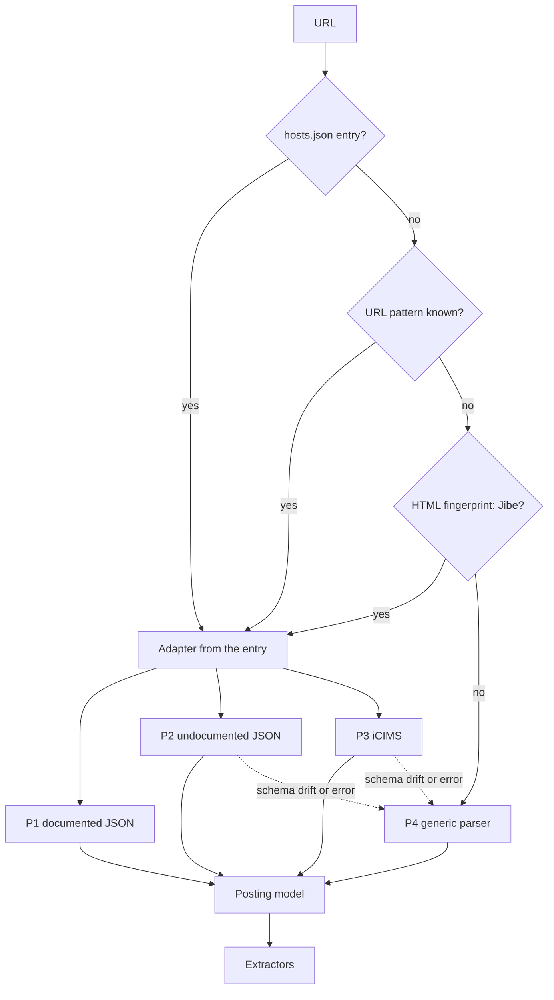

# Extraction pathways

Each source is grouped by *how* data is extracted. A pathway is one fetch strategy; each ATS is a thin adapter (URL patterns, endpoints, field mapping) in `src/jobtracker/adapters/`.

Endpoints were probed with real requests on 2026-10-05 and responses saved as test fixtures (`tests/fixtures`, refreshed with `scripts/capture_fixtures.py`). **Verified** below means list and detail calls both returned the expected data.

## Summary

| Pathway | Sources | Transport | Stability |
|---|---|---|---|
| **P1: documented public JSON** | Greenhouse, Lever, Ashby, SmartRecruiters | GET JSON | stable |
| **P2: undocumented JSON the career site itself calls** | Workday, Oracle Cloud HCM, Eightfold, Amazon Jobs | GET/POST JSON | can change without notice |
| **P3: iCIMS** | Jibe sites (DocuSign): JSON. Classic portals (Atlassian): HTML + JSON-LD | mixed | Jibe moderate, classic low |
| **P4: generic fallback** | everything else, and Avature (no API: paged search HTML plus each job's JSON-LD) | HTML: JSON-LD, then page text | Avature moderate, rest n/a |

A "posting gone" result (404/410, or Workday's 403 `S22`) is reported to you and never degraded to the generic parser.

## P1: documented public JSON (all verified)

| Source | List (board watcher) | Detail | Config | Notes |
|---|---|---|---|---|
| Greenhouse | `boards-api.greenhouse.io/v1/boards/{token}/jobs` | `…/jobs/{id}?pay_transparency=true` | board token | description arrives HTML-escaped (the text layer unescapes it); requisition ID is sometimes junk ("See Opening ID") and is rejected; vanity URLs with `?gh_jid=` need the token from `hosts.json` or the page |
| Lever | `api.lever.co/v0/postings/{company}?mode=json` | `…/{company}/{id}` | company slug | EU tenants use `api.eu.lever.co`; carries `workplaceType` |
| Ashby | `api.ashbyhq.com/posting-api/job-board/{board}?includeCompensation=true` | none (read from the listing) | board name | prints pay when the employer publishes it |
| SmartRecruiters | `api.smartrecruiters.com/v1/companies/{id}/postings` | `…/postings/{postingId}` | company identifier | the `hybrid` flag is a vendor field and can disagree with the posting text |

## P2: undocumented JSON (all verified, with caveats)

| Source | List | Detail | Config | Notes |
|---|---|---|---|---|
| Workday | `POST /wday/cxs/{tenant}/{site}/jobs` | `GET /wday/cxs/{tenant}/{site}{externalPath}` | tenant, site and `wd` host come from the real URL, never guessed | a **closed posting answers 403 errorCode S22**, treated as "gone". About a third of the Notion rows are Workday |
| Oracle Cloud HCM | `GET /hcmRestApi/resources/latest/recruitingCEJobRequisitions` with `finder=findReqs;siteNumber=…` | `…/recruitingCEJobRequisitionDetails` with `finder=ById;Id="…"` | host and site number (`CX_1001` for JPMC); company names in `hosts.json` (JPMC, American Express host `egug.fa.us2.oraclecloud.com`) | JPMC puts pay in a flex field, usually USD, which is ignored (INR only) |
| Eightfold | `GET /api/pcsx/search?domain=…` | `GET /api/pcsx/position_details?position_id=…&domain=…` | host and email domain (`paypal.com`, `microsoft.com`) | the `/api/apply/v2/jobs` path returns 403; use `pcsx`. Microsoft is served from `apply.careers.microsoft.com` |
| Amazon Jobs | `GET www.amazon.jobs/en/search.json?base_query=…&country=IND` | the same endpoint with the requisition ID as `base_query` | none | returns basic and preferred qualifications already separated; not in the original list but about 12% of the Notion rows |

Listing caps: adapters read at most a few pages per check and report whether the listing was complete. An incomplete listing never closes postings (see [decisions.md](decisions.md), decision 13). Requests are spaced to one per second per host, with a normal browser user-agent, and backed off on 429/5xx.

## P3: iCIMS

| Shape | Example | Behaviour |
|---|---|---|
| Jibe careers site | DocuSign: `careers.docusign.com` | `GET /api/jobs?page=&limit=` returns JSON with explicit `responsibilities` and `qualifications` (split into required vs preferred). There is **no single-job endpoint**: the adapter filters by keyword and pages as a fallback. Detected by the `data-jibe-search-version` marker or `hosts.json` |
| Avature career site | `dth.avature.net/en_US/careers` | no API. **Listing:** `{base}/SearchJobs/?jobOffset=N`, 10 rows a page, read until the page's own "of N results" is reached (cap 40 pages, then reported incomplete so nothing is marked closed); each row gives id, title and place. **Posting:** `{base}/JobDetail/{slug}/{id}` carries a JobPosting JSON-LD block with the full description (the visible page loads it separately). The place is often empty in that block, so location can be blank. An RSS feed exists but holds only the latest 20. Your own domain running Avature goes in `hosts.json` with `"config": {"base": "https://careers.example.com/en_US/careers"}` |
| Classic iCIMS portal | Atlassian, DocuSign India: `*.icims.com/jobs/{id}/…/job` | page parsed from its JSON-LD (verified). Closed postings return 410. **Listing is not supported**, so these boards cannot be watched |

## P4: generic

1. Fetch the page, read `application/ld+json` `JobPosting` (title, organisation, location, salary, date, description).
2. Otherwise take the title from `og:title` / `h1` and the largest content block.
3. Missing hard fields go to the LLM fallback if configured.

This is the weakest path. On the 100-row export, LinkedIn, Indeed (401), Tesco (403) and several custom sites parsed poorly or not at all.

## Resolution order and configuration

1. **`config/hosts.json`**: exact host to ATS, company name, slug and extras. Examples: `careers.servicenow.com` is SmartRecruiters `ServiceNow`; `stripe.com` is Greenhouse `stripe`; `apply.careers.microsoft.com` is Eightfold domain `microsoft.com`.
2. **URL patterns** each adapter recognises (`boards.greenhouse.io`, `jobs.lever.co`, `*.myworkdayjobs.com`, `*.fa.*.oraclecloud.com`, `*.eightfold.ai`, `amazon.jobs`, `*.icims.com`, …).
3. **HTML fingerprint** (currently Jibe).
4. **Generic parser.**

Adding a new vanity domain is a one-line `hosts.json` entry.

## Measured on the Notion export

100 links Claude had already processed (11 postings have since closed, 3 rows have no link): the pipeline fetched and parsed most of the rest. Amazon, Oracle and Workday were the cleanest; the generic path was the weakest. Run `uv run python scripts/golden.py` for the current numbers.

### Workday notes
- **Apply links.** An address ending in `/apply` (or `/apply/applyManually`) is cut back to the job page before asking the API, which only knows the job page.
- **Filters.** A pasted address keeps Workday's own filter state in its query (`?locations=ID&jobFamilyGroup=ID&q=text`); it is read as the board's filters. A board's Location entries are matched against the tenant's place filter (found by name in the facet tree, wherever the tenant nests it) and only those offices are requested. The listing is newest first and read up to 200 postings.
- **Careers sites in front.** Radancy TalentBrew and Phenom sites only display jobs; their Apply button points at the real system. When a pasted page has exactly one Apply link to a supported system, the job is read from there and saved under that system's address; the careers page is kept as the "careers page" link.
